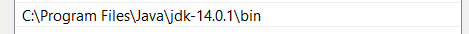
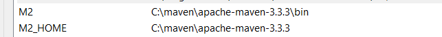
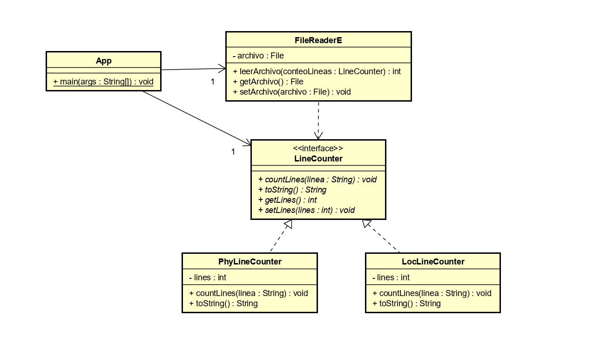
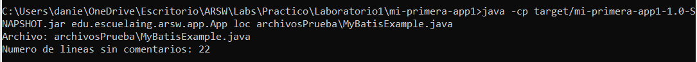
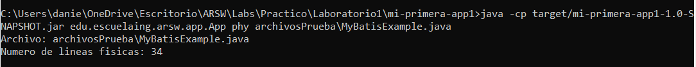
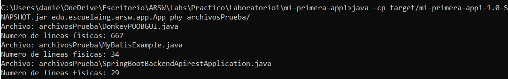
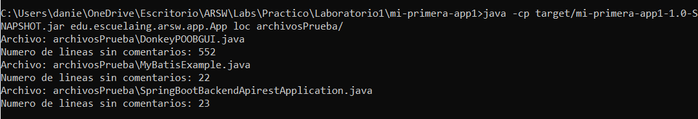
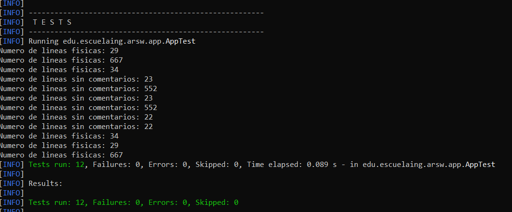
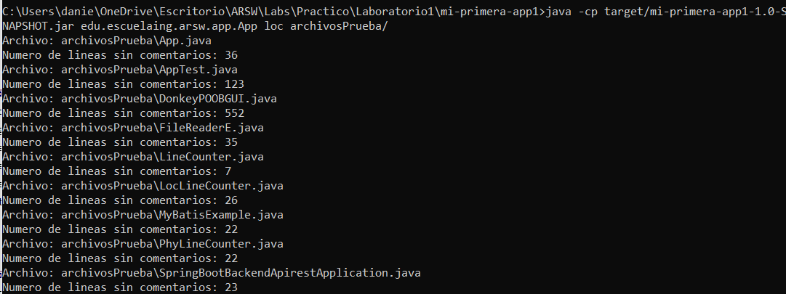

## Autor: Daniel Felipe Alfonso Bueno 
## Profesor: Luis Daniel Benavides 
## ARSW - Arquitectura de Software 2020-I
# Loc Counting 
El proyecto Loc Counting busca realizar dos tipos de conteo, sobre sus líneas de código JAVA 
para poder establecer una métrica de productividad de líneas de código por hora. Este proyecto le permitirá contar
las líneas de código físicas, esto quiere decir todas las líneas escritas sobre nuestro código fuente, así mismo conteo de solo líneas que sean
código omitiendo los tipos de comentarios existentes en JAVA. 

249LOCS / 13Hours = 19.45 LOC/hour. 
## Prerrequisitos
Se requiere la instalación previa de JDK y maven para la ejecución del proyecto en consola, se hará una demostración de la ejecución del 
proyecto más adelante. Por ahora podremos descargar JDK [JAVA](https://www.oracle.com/technetwork/es/java/javase/downloads/index.html) aquí descargaremos 
la versión 8 que es compatible, es un instalador normal, después debemos actualizar las variables de entorno del sistema para ejecutar por consola
los comandos de compilación y ejecución de JAVA. Como se muestra primero en la variable PATH del sistema dirigida a la carpeta bin
donde están los ejecutables en este caso los ejecutables java, javac.
 

Después creamos la variable JAVA_HOME y la dirigimos a la carpeta donde se instaló JDK  

Igualmente para MAVEN, podremos descargar la carpeta de binarios desde la página de [MAVEN](https://maven.apache.org/download.cgi) para posteriormente
realizar la configuración de la variable de entorno.

 

Creamos una variable HOME que apunta a la carpeta de instalación de MAVEN y otra que apunta a la carpeta 
bin, para que logremos ejecutar el comando mvn en consola.

## Diseño

### Descripción 
En este diagrama contamos con tres clases y una interfaz en la parte del modelo o lógica de negocio.
La clase APP es la clase principal que seria la fachada, la cual tiene una relación por atributo con FileReaderE(Clase que lee archivo y guarda conteo) la cual usa
la interface LineCounter (Encargada de contar las líneas de código). Dos clases implementan esta interfaz
y sobrescriben el método countLines para contar las líneas(Cada una lo hace de manera diferente) y toString para mostrar el resultado dependiendo del método
de conteo elegido en la clase APP o main.  

## Uso del Proyecto 
Para ejecutar nuestro proyecto, primero debemos clonarlo con el siguiente link https://github.com/DanielAlfonso17/ARSWLAB1.git con la aplicación 
[Git](https://git-scm.com/downloads). Desde la consola, podemos ejecutar 
~~~ 
git clone https://github.com/DanielAlfonso17/ARSWLAB1.git 
~~~ 
Una vez descargado, para compilarlo abrimos nuestro terminal de comandos o CMD.
Entramos en el directorio de nuestro proyecto  y ejecutamos el comando 
~~~ 
mvn package 
~~~

En el proyecto hay una carpeta llamada archivosPrueba, allí encontraremos los archivos que pasaremos
a nuestro programa para que cuente las líneas de código, si desea puede agregar más archivos o eliminar 
los que están para hacer sus pruebas. 
para ejecutar nuestro proyecto, como vemos en la imagen anterior genero un archivo .jar en la carpeta target 
que será el que ejecutaremos mediante el comando
~~~ 
java -cp target/mi-primera-app1-1.0-SNAPSHOT.jar edu.escuelaing.arsw.app.App loc archivosPrueba\MyBatisExample.java
~~~
Seleccionamos el jar que generamos, cuando construimos la aplicación, seguido ponemos la clase 
donde se encuentra el programa principal o main, después el parámetro loc nos indicara el tipo de conteo que 
queremos realizar como se mencionó anteriormente, Loc cuenta las líneas exclusivas de código sin comentarios 
y phy las líneas físicas(Todas las líneas). como resultado obtenemos: 
 
~~~ 
java -cp target/mi-primera-app1-1.0-SNAPSHOT.jar edu.escuelaing.arsw.app.App phy archivosPrueba\MyBatisExample.java
~~~ 
Ejemplo con líneas físicas.
 
También se tiene la función de ejecutar en un directorio con archivos de forma recursiva para que cuente las líneas de estos
como se muestra con el comando como tercer parámetro, en lugar de poner un archivo pondremos un directorio donde tengamos archivos .java
Obtenemos el nombre del archivo y el número de líneas. 
~~~ 
java -cp target/mi-primera-app1-1.0-SNAPSHOT.jar edu.escuelaing.arsw.app.App phy archivosPrueba\
~~~

~~~ 
java -cp target/mi-primera-app1-1.0-SNAPSHOT.jar edu.escuelaing.arsw.app.App loc archivosPrueba\
~~~

## Ejecución de Pruebas
Cuando ejecutamos el comando 
~~~
mvn package
~~~ 
Aquí mismo se realizaran las pruebas realizadas. 
 Podemos observar que pasan todas las pruebas
establecidas en el proyecto para distintos archivos, que se encuentran en la carpeta archivosPrueba, se tuvo en cuenta cuando 
el conteo exitoso tanto para las líneas físicas como para los locs. También se evaluó casos en que 
el conteo debería fallar. 
También se añadieron los archivos del proyecto a la carpeta archivosPrueba para realizar el cálculo de la métrica
LOCS/Hour como se puede observar 

los archivos suman un total de 249 LOCS, invertí en el proyecto 14 horas 
para una métrica de 249 / 13 = 19.45 LOC/hour.

